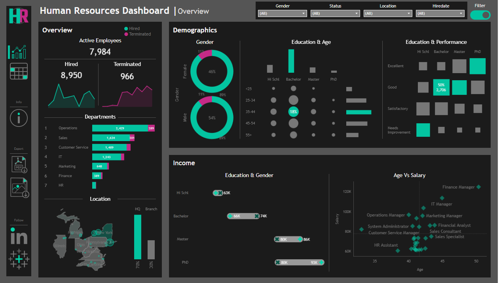
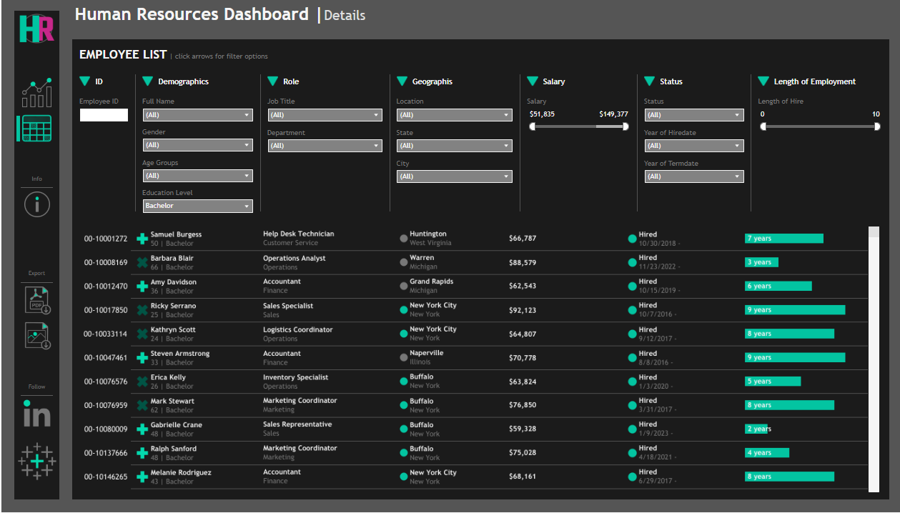

# HR Analytics Dashboard in Tableau

## 🚀 Project Overview

This project presents a comprehensive HR Analytics Dashboard built using Tableau. It's designed for an HR Manager to effectively analyze human resources data, providing both a high-level summary view for quick insights and a detailed employee records view for in-depth analysis. The dashboard helps in tracking key HR metrics, understanding workforce demographics, and analyzing compensation structures.

## 🚀 Live Dashboard on Tableau Public

You can view and interact with the live dashboard directly in your browser by visiting the link below.

➡️ **[View the Interactive HR Dashboard on Tableau Public](https://public.tableau.com/shared/6C2G3PBDW?:display_count=n&:origin=viz_share_link)**

*(Note: Remember to replace the placeholder URL with the actual link to your dashboard.)*

## 🎯 User Story

> As an HR manager, I want a comprehensive dashboard to analyze human resources data, providing both summary views for high-level insights and detailed employee records for in-depth analysis.

---

## 📊 Dashboards

The project consists of two main interactive dashboards:

1.  **Summary Dashboard:** A high-level overview of the entire workforce.
2.  **Employee Records Dashboard:** A detailed, filterable list of all employees.

### 1. Summary Dashboard

This dashboard provides a holistic view of the organization's human capital and is divided into three key sections.

#### **📈 Overview**

This section provides a snapshot of overall HR metrics, including:

* **Key Metrics:** Total count of hired, active, and terminated employees.
* **Hiring & Termination Trends:** A visualization of total hired and terminated employees over the years.
* **Department & Role Breakdown:** A view of the total number of employees by department and job title.
* **Geographical Distribution:**
    * A comparison of total employees between headquarters (New York) and branch locations.
    * A map visualizing the distribution of employees by city and state.

#### **👥 Demographics**

This section offers insights into the composition of the workforce:

* **Gender Ratio:** A clear visualization of the gender distribution within the company.
* **Age & Education:**
    * Distribution of employees across various age groups.
    * Breakdown of the total number of employees by their highest level of education.
* **Education & Performance:** An analysis showing the correlation between employees' educational backgrounds and their performance ratings.

#### **💰 Income Analysis**

This section focuses on salary and compensation metrics:

* **Salary by Education & Gender:** A comparative analysis of salaries across different education levels for both genders to identify patterns or discrepancies.
* **Age, Salary & Department:** A correlation analysis of employee age and salary within each department.

---

### 2. Employee Records Dashboard

This dashboard provides a detailed, tabular view of all employee records. It is designed for granular analysis and specific lookups.

* **Comprehensive Data:** The view includes essential employee information such as **Name, Department, Role, Gender, Age, Education, and Salary**.
* **Advanced Filtering:** Users can dynamically filter the entire list based on any of the available columns to find specific employees or analyze subgroups.

---

## 🛠️ How to Use

There are two ways to explore this project:

1.  **Live Dashboard (Recommended):** The easiest way is to view the interactive dashboard directly on **[Tableau Public](https://public.tableau.com/app/profile/your-profile/viz/your-dashboard-name)**.

2.  **Local File:**
    * Clone this repository or download the `HR_Dashboard.twbx` file.
    * Open the file using [Tableau Desktop](https://www.tableau.com/products/desktop) or the free [Tableau Reader](https://www.tableau.com/products/reader).

## 🔧 Tools Used

* **Tableau:** The primary tool used for data visualization and dashboard creation.
